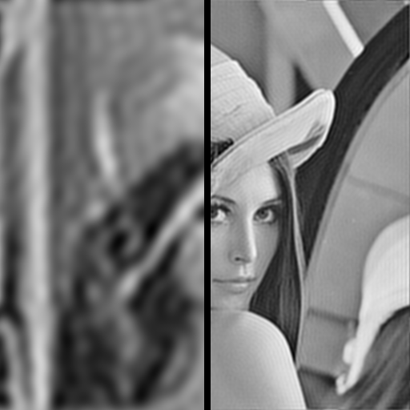
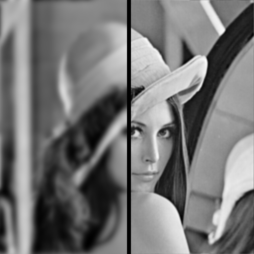
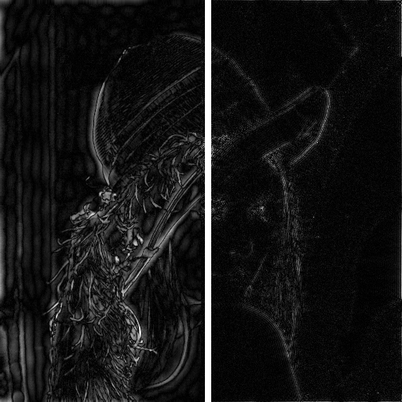
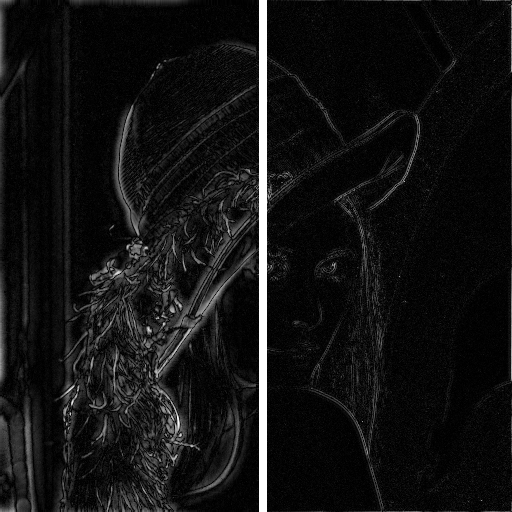
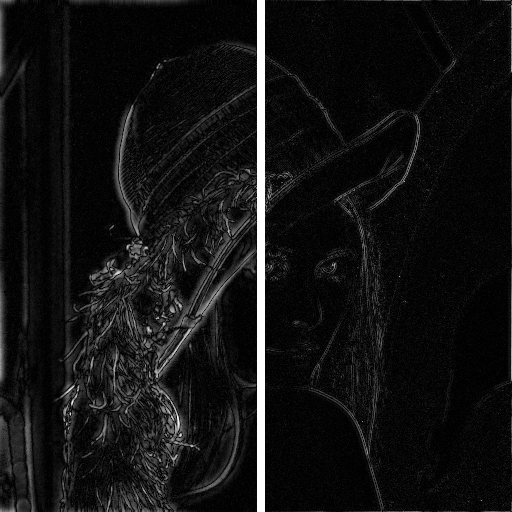
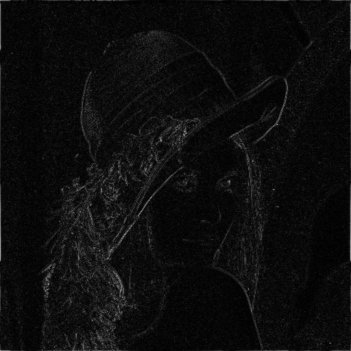

# Team B5 Report


## Run Filtering Server
```
  $conda env create -f environment.yml

  $conda activate filtering_server-dev

  $export FLASK_APP=Filtering_Server

  $export FLASK_ENV=development

  $flask run
```

## Objectives
Our objectives for this project were primarily to compute the DFT of an image in an efficient manner. The efficiency of this process is important because the DFT we compute is integral to the image processing component of the application.

We implemented the following filters as part of the image processing component:
* Ideal (Low/High) Pass
  * Ideal Band (Pass/Reject) Filters
* Butterworth (Low/High) Pass
  * Butterworth Band (Pass/Reject) Filters
* Gaussian (Low/High) Pass
  * Gaussian Band (Pass/Reject) Filters
* Laplacian Filter
* High Boost Filter
* Unsharp Mask Filter

In the next section, we will provide results of these filters along with a small explanation of the processing method.

## Filters

We'll be using the ubiquitous *Lenna* image, found everywhere throughout the field of Image Processing, for our comparisons:


While it doesn't affect the image results, the following images will be generated with the Numpy method FFT method instead of the Team B5 method.

### Smoothing Frequency Filters

Smoothing can be achieved in the frequency domain by attentuting the high-frequency components of the Fourier transform of a certain image.

The left side of each sample image has a cutoff of 20, while the right side has a cutoff of 100.

#### Ideal Lowpass
The ideal lowpass filter is the simplest lowpass filter; it essentially "cuts off" all components of the Fourier transform that are higher than a certain cutoff. This cutoff is the distance from the origin of the Fourier transformed image.



*Ideal lowpass filter applied to Lenna.png. Note the "ring" effect visible on both images.*

#### Butterworth Lowpass
The Butterworth lowpass filter is different from the ideal lowpass filter in that it does not have a sharp cutoff value, but instead smoothly transitions between high and low frequencies. A Butterworth lowpass filter with a higher order will produce an image with 'more' lowpass filtering but also will exhibit much more ringing. An order of 2 is usually considered acceptable for most purposes, as it produces a good compromise between lowpass filtering and reducing ringing.



*Butterworth lowpass filter applied to Lenna.png. Both images have an order of 2.*

#### Gaussian Lowpass
While the smoothing effect of the Gaussian lowpass is not as apparent as the Butterworth, the Gaussian lowpass filter *guarantees* no ringing effect. This is key in situations such as medical imaging, where the introduction of any kind of artifact is unacceptable. The Gaussian filter for smoothing usually produces better results than the previous two filters.


*Gaussian Lowpass filter applied to Lenna.png.*


### Sharpening Frequency Filters

Image sharpening can be accomplished in the frequency domain by attentuating the low frequencies of the Fourier transform of an image. Note that these images have not bee added back to the original images; thus, only the direct filter output is shown.

The left side of each sample image has a cutoff of 20, while the right side has a cutoff of 100.

#### Ideal Highpass
This filter is the opposite of the ideal lowpass filter, in that it "cuts off" all components of the Fourier transform that are *lower* than a certain cutoff value. This cutoff value is still the distance from the origin of the Fourier transformed image.



*Ideal Highpass Filter applied to Lenna.png.*

#### Butterworth Highpass
This filter is the opposite of the Butterworth lowpass filter. Like the ideal highpass, it modifies components of the Fourier transform that are *lower* than a certain value. Again, the Butterworth filter doesn't "cut off" but rather smoothly transforms between the low and high frequencies.



*Butterworth Highpass Filter applied to Lenna.png. Both images have an order of 2.*

#### Gaussian Highpass
The Gaussian highpass filter is the opposite of the Gaussian lowpass filter. The same qualities of the lowpass filter apply here as well; the Gaussian highpass filter is considered to produce better quality smoothing than the previous two filters.



*Gaussian Highpass Filter applied to Lenna.png.*


#### Laplacian Filter
The Laplacian filter produces images with edge-lines at large gray-level discontinuities. Essentially, this means that the Laplacian filter creates edges at points where the grey level differs harshly, e.g. at actual edges in the original image. The Laplacian filter emphasizes large discontinuties and deemphasizes gray levels that vary slowly. 



*Laplacian Filter applied to Lenna.png. Remember that this is the actual image produced by the Laplacian filter, and **not** the "enhanced" version of the original image. To get this enhanced version, the above image would have to be subtracted from the original.*

#### Unsharp Mask Filter


#### High Boost Filter


### Bandreject Filters


### Bandpass Filters
